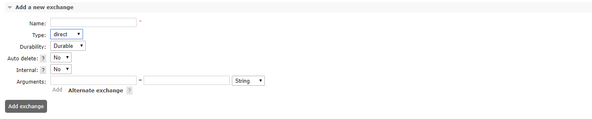
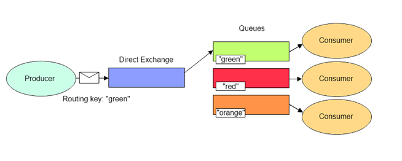
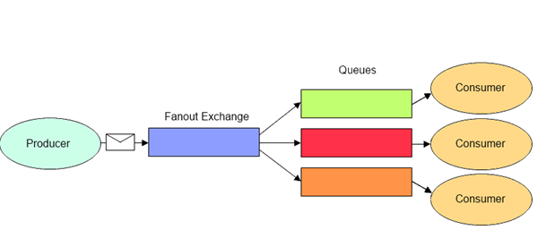
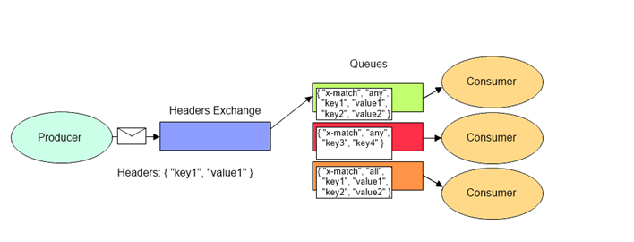
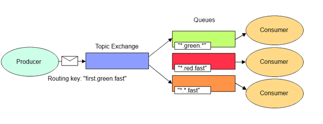
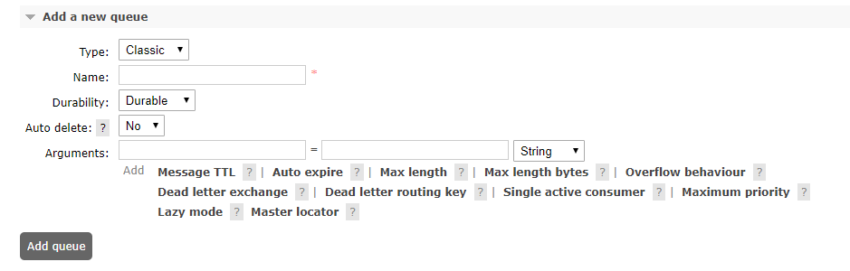
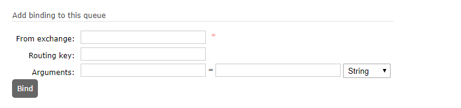

# MessageBroker
**Purpose**  
The purpose of this repository is have multiple microservices having application to application integration via Message Brokers. 

https://www.rabbitmq.com/tutorials/amqp-concepts.html
# Concepts
----------
1. Exchange  
   An exchange is a interface to which application pushes messages. It is the responsibility of the exchange to push messages to registered queues. 
   The application does not need to worry about sending messages to new queues as they get added. The queues register themselves to Exchanges.  
     
   ### Type ###
   - Direct - These exchanges deliver messages to one queue (identified by routing key).  
     
   - Fanout - Here exchanges deliver messages to all the bound queues. Used for publish subscribe .  
    
   - Header - Exchange deliver message to queue with matching the rules specificed in header.  
       
   - Topic - Exchanges deliver messages to all queue that match(also partly match) routing rule.  
    

   Difference between Header and Topic - Topic used routing to identify the queues to forward.  
   ## Attributes ##
   ### Auto Delete ### 
   If yes, the Exchange will delete itself after at least one queue has connected, and then all queues have disconnected.  
   ### Internal ###
   If yes, clients cannot publish to this exchange directly. It can only be used with exchange to exchange bindings.  
   ### Arguments ###
   - Alternate Exchange - If messages to this exchange cannot otherwise be routed, send them to the alternate exchange named here.
     
2. Queue  
   Queue is an abstraction to which consuming application subscribes to along with.  
     
      
    ## Attributes ##  
    ### Type ###
    - Classic
    - Quorum  
      
    ### Durability ###  
    - Durable - This queues survive the restart of the Message broker. 
    - Transient - These are ephemeral queue, which get deleted after a MB restart.  
    ### Auto Delete ###  
    If yes, the queue will delete itself after at least one consumer has connected, and then all consumers have disconnected.  
    ### Arguments ####
    - Message TTL - How long a message published to a queue can live before it is discarded (milliseconds).
    - Auto Expire - How long a queue can be unused for before it is automatically deleted (milliseconds).
    - Max Length  - How many (ready) messages a queue can contain before it starts to drop them from its head.
    - Max Length Bytes - Total body size for ready messages a queue can contain before it starts to drop them from its head.
    - Overflow Behavior - Sets the queue overflow behaviour. This determines what happens to messages when the maximum length of a queue is reached. Valid values are drop-head, reject-publish or reject-publish-dlx. The quorum queue type only supports drop-head.
    - Dead Letter Exchange - Optional name of an exchange to which messages will be republished if they are rejected or expire.
    - Dead Letter Routing Key - Optional replacement routing key to use when a message is dead-lettered. If this is not set, the message's original routing key will be used.
    - Single Active Consumer - If set, makes sure only one consumer at a time consumes from the queue and fails over to another registered consumer in case the active one is cancelled or dies.
    - Maximum Priority - Maximum number of priority levels for the queue to support; if not set, the queue will not support message priorities.
    - Lazy mode - Set the queue into lazy mode, keeping as many messages as possible on disk to reduce RAM usage; if not set, the queue will keep an in-memory cache to deliver messages as fast as possible.
    - Master Locator - Set the queue into master location mode, determining the rule by which the queue master is located when declared on a cluster of nodes.
   
3. Binding  
    The process of associating a queue to an exchanges along with routing rules(routing key).  
    

4. Routing Key

